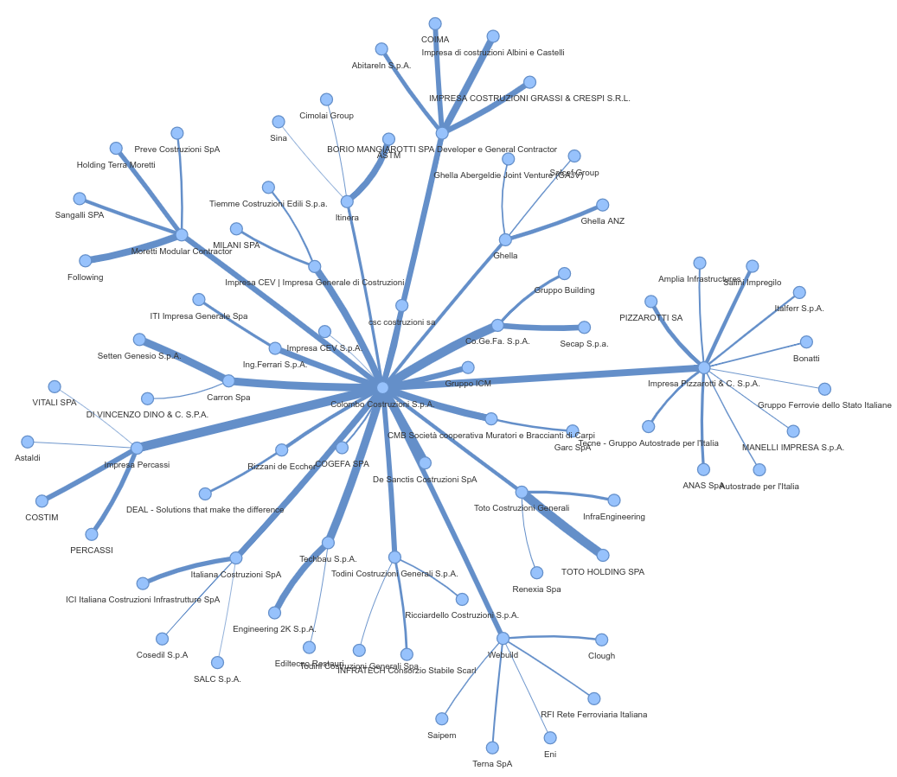

# OSINT Linkedin meta analysis

## ANALYSIS' STEPS
1) Gather the data of "Pages people also viewed" section of a target company Linkedin page(colombo costruzioni s.p.a.)
2) Repeat (1) for every company in step one
3) Assign a weight given the ranking of appearence in the "Pages people also viewed" section
4) Create a directed graph with networkx with the edges
5) Transform the directed graph in undirected for MST algorithm
6) Visualize the graph

The graph rappresent the network of similar companies o the target, here the result

